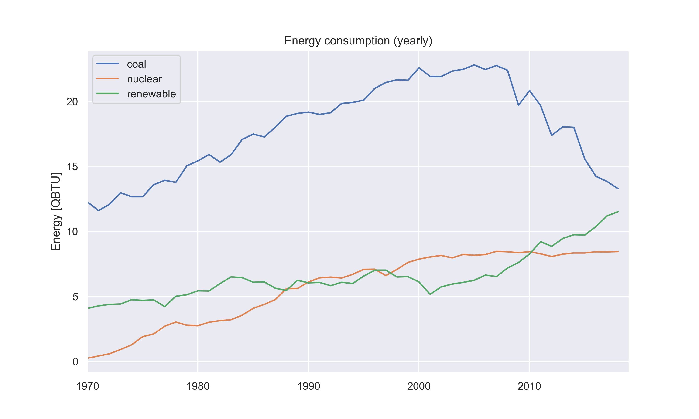

# *pyleiades*
[](https://travis-ci.org/mitchnegus/pyleiades)

## Python Library for EIA Data Examination & Exhibition

###### A tool for creating visuals from historical energy data (e.g. the EIA monthly energy review).
 
This tool is designed to provide insightful, aesthetic and more flexible visualizations of the Energy Information Administration (EIA) monthly energy review datasets.
The datasets contain information about the sources of energy Americans have relied on for power since the middle of the 20th century. 
The datasets begin in 1949 with annual energy production, consumption, import, and export values, and extend up until the present. 
Monthly energy datapoints are reported starting in 1973.

The basic energy sources are reported in the following groups:  

###### Fossil Fuels
* Coal
* Natural Gas
* Petroleum

###### Renewables
* Wind
* Solar
* Hydroelectric
* Geothermal
* Biomass

###### Nuclear
* Fission

The data is published monthly on the [EIA's website](https://www.eia.gov/totalenergy/data/monthly/), and as of March 31st, 2019 records were provided up through December 2018. This package also includes data up to date through the end of 2018, though more recent data can be downloaded using an included script. 

All reported values are in units of quadrillion british thermal units (1.0E15 BTU). Be aware that the datasets may provide [more precision](https://www.eia.gov/totalenergy/data/monthly/dataunits.php) than is published in the PDF reports.

## Installation

_pyleiades_ is hosted through the Python Package Index (PyPI) and can be easily installed using pip.
From the command line, run

```
$ pip install pyleiades
```

The module requires a recent version of Python 3 (3.6 or greater), pandas, and matplotlib, among others.
If you run into trouble running the package, try using the Anaconda environment provided in this repo.
Install the environment using the command

```
$ conda env create -f environment.yml
```

and activate the environment by issuing the command

```
$ conda activate pyleiades
```

## Updating

An archive of EIA Monthly Energy Review datasets is kept in the `pyleiades` data repository. 
This may not include the most up to date information, and so the package comes with a script to update the available data.
Once the package is installed, run 

```
$ update_eia_data.py
```

from the command line to download the most recent data from the EIA website. 

## Using the API

The API is built around two main object types—the `Energy` and `Visual` classes.

### The `Energy` object

To access the EIA data directly for a certain energy type, use the `Energy` class.
For example, the energy consumption data for all renewable energy sources can be accessed with:

```
>>> from pyleiades import Energy
>>> renewables = Energy('renewable')
```

The resulting `renewables` object stores the complete consumption history within the `energy_data` dataframe attribute.

```
>>> renewables.energy_data
        date      value
6220    1949   2.973984
6221    1950   2.977718
6222    1951   2.958464
6223    1952   2.940181
...
```

The `date` column gives the reporting date (in the format `YYYY` for full year totals or `YYYY-MM` for monthly totals) and the `value` column gives the consumption amounts (in QBTU) for each date. 

Energy consumption values are the default, however the `Energy` objects can also be used to access production, import and export statistics.
The type of statistic can be selected using the `stat_type` keyword argument.

```
>>> renewables = Energy('renewable', stat_type='production')
>>> renewables.energy_data
        date     value
6220    1949  1.549262
6221    1950  1.562307
6222    1951  1.534669
6223    1952  1.474369
```

Perhaps more interesting than the complete history, however, are more sophisticated features of the data, like interval specific totals and extremes.

Using the `totals` method of an `Energy` object allows the data to be totaled at a specified interval—either monthly, yearly, or cumulatively.

```
>>> renewables.totals('monthly')
            value
   date
1973-01  0.403981
1973-02  0.360900
1973-03  0.400161
1973-04  0.380470
```

Notice that here the monthly data only goes back as far as 1973 (though the `energy_data` attribute showed yearly data for renewable energy dating back to 1949). 
By default, the `totals` method selects the entire range of available data, though what is available on a monthly vs. yearly basis might be different. 
This  behavior can be overriden by providing start and end dates for some interval as keyword arguments.
To only get monthly renewable energy data from 2000 to 2010, this would be:

```
>>> renewables.totals(freq='monthly', start_date='2000-01', end_date='2009-12')
            value
   date
2000-01  0.505523
2000-02  0.498993
2000-03  0.558474
2000-04  0.567147
```

To get extremes over a dataset interval, use the `maxima` or `minima` methods.

### The `Visual` object

A `Visual` allows the package to create plots of several energy types. 
The initialization parameters for a `Visual` are similar to those for an `Energy` object. 
A `Visual` can accept a single energy type or a list of energy types, optionally followed by a type of statistic (consumption by default).

```
visual = Visual(['coal', 'nuclear', 'renewable'])
```

This visual object's methods can then be used to generate any of a variety of visuals. 

To generate a linegraph of energy totals, use the `linegraph` method.
The syntax is again similar to that of the `Energy` object's `totals` method.
Here's an example:

```
visual.linegraph(freq='monthly', start_date='1970')
```



Run the very simple installed script `pyleiades-demo.py` to see the package in action.
